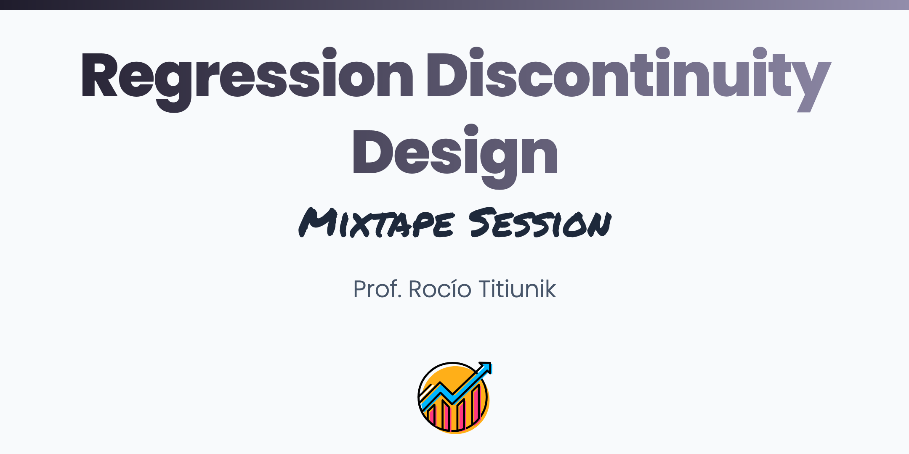

 
 

## About

This course covers methods for the analysis and interpretation of the Regression Discontinuity (RD) design, a non-experimental strategy to study treatment effects that can be used when units receive a treatment based on a score and a cutoff. The course covers methods for estimation, inference, and falsification of RD treatment effects using two different approaches: the continuity-based framework, implemented with local polynomials, and the local randomization framework, implemented with standard tools from the analysis of experiments. The focus is on conceptual understanding of the underlying methodological issues and effective empirical implementation. Every topic is illustrated with the analysis of RD examples using real-world data, walking through R and Stata codes that fully implement all the methods discussed. At the end of the course, participants will have acquired the necessary skills to rigorously interpret, visualize, validate, estimate, and characterize the uncertainty of RD treatment effects.

## Schedule

<b>Day 1</b>
 

<b>Topics</b>

- Sharp RD design: introduction and graphical illustration with RD plots

- Continuity based RD analysis  

- Estimation of RD effects with local polynomials

- Optimal bandwidth selection

<b>Slides</b>

<b>Readings</b>

 

<b>Day 2</b>
 

<b>Topics</b>

- Continuity based RD analysis, continued

- Robust confidence intervals based on local polynomials

- Local Randomization RD analysis

  - Window selection based on covariates

  - Inferences based on Fisherian methods

- Inferences based on large-sample methods

<b>Slides</b>

<b>Readings</b>

 

<b>Day 3</b>
 

<b>Topics</b>

- Falsification of RD assumptions: density and covariate balance tests

- Imperfect compliance: The Fuzzy RD design

<b>Slides</b>

<b>Readings</b>

 
